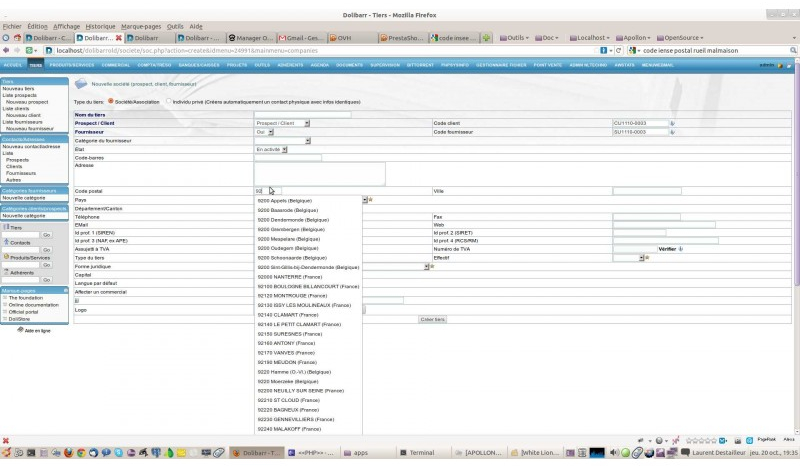

## DoliAutoZip ##
### External Dolibarr module AutofillZipCode ###
**Tags:**                   dolibarr, france zipcode, tunisie zipcode

**Module Contact:** askri.nasredinne@gmail.com
**Requires at least:**     5.0.0  
**Tested up to:**         5.0.1  
**License:**               GPL-3.0+  
**License URI:**           http://www.gnu.org/licenses/gpl-3.0.html
**Contributors:** www.kb2i.com
    
### 1. Features ###
**1.a)  Known missing (TODO)**
* Update method for incorrect code from a parameterization interface 
* Select specific zipcode to specific region in precise country

**1.b) Known issues**

DoliAutoZip manage various country zip code
* Tunisie
* France
* Algeria ( soon )
* Morroco ( soon )
* Italy ( soon )
All other countries are missing. Contributions welcome!

### 2. Requirements ###
    Dolibarr 5.0 with mysql database 5.1 or Higher

### 3. Installation ###

 1. Be certain for the access rights on your operating system, especially linux
    chmod a+x DoliAutoZip.zip
  2. Extract the zip file to the 'dolibarr/htdocs' directory of web server
  3. Activate the module from Configuration -> Modules page
  4. Go to 'DoliAutoZip' 'Settings' under the ' Configuration -> Company/Instution' tab and select the 'zip code' fill

### 4. Screenshots ###

### 5. The configuration page ###

### 6. Changelog ###

  **0.0.1**
* Refactor French zipcode database
* Fixed thirdparties creation (prevented Dolibarr order crea
